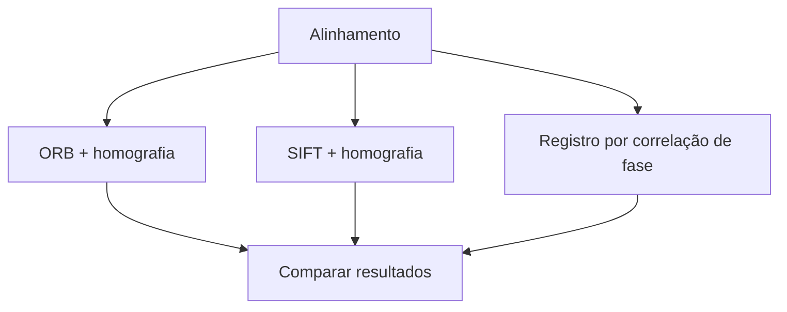

# Proposta Técnica — Vistoria Automática de Veículos (Antes/Depois)

## 1. Problema

Locadoras de veículos precisam verificar, no momento da devolução do carro,
se houve algum dano novo (risco, amassado, trinca) causado durante o
período de uso pelo cliente. Essa comparação é feita hoje majoritariamente
de forma manual: um funcionário confere visualmente as fotos tiradas antes
e depois da locação.

Este problema envolve processamento e análise de imagens porque a decisão
depende de comparar duas imagens do mesmo objeto (o veículo) em momentos
diferentes, e identificar **divergências visuais localizadas** entre elas —
uma tarefa de comparação estrutural de imagens, segmentação de regiões e,
possivelmente, classificação do tipo de divergência encontrada.

Situação inicial: duas fotos do mesmo veículo, tiradas em momentos
diferentes (antes e depois do aluguel), possivelmente com pequenas
variações de ângulo, distância, iluminação e enquadramento.

Informação a ser produzida a partir das imagens: (a) se existe alguma
divergência visual compatível com dano entre as duas fotos; (b) em que
região da imagem essa divergência está localizada; (c) *(meta futura,
M2/M3)* que tipo de dano é (risco, amassado, trinca).

## 2. Contexto de aplicação

O sistema seria utilizado por locadoras de veículos no processo de
devolução, como apoio à vistoria feita pelo funcionário — não como
substituto do julgamento humano, mas como uma ferramenta que destaca
regiões suspeitas para revisão. O mesmo princípio se aplica a empresas de
gestão de frotas que fazem checagens periódicas dos veículos.

## 3. Objetivo

**Objetivo geral:** dado um par de imagens (antes/depois) do mesmo
veículo, produzir um mapa das regiões com divergência visual relevante
entre as duas imagens, indicando candidatos a dano novo.

**Objetivos específicos:**
- Alinhar corretamente as duas imagens, compensando pequenas diferenças
  de ângulo e posição da câmera.
- Comparar estruturalmente as imagens alinhadas para localizar regiões
  divergentes.
- Filtrar divergências que não correspondem a dano real (sombra, reflexo,
  sujeira, variação de iluminação).
- *(Meta para M2/M3)* Classificar o tipo de dano identificado.

## 4. Entrada e saída esperadas

**Entrada:** duas imagens do mesmo veículo (mesma região/ângulo aproximado),
capturadas em momentos diferentes.

**Saída:** indicação binária de "há divergência relevante?" + localização
(bounding boxes ou mapa de calor) das regiões candidatas a dano.

Pipeline conceitual:

```mermaid
flowchart LR
    A1[Imagem "antes"] --> C[Pré-processamento]
    A2[Imagem "depois"] --> C
    C --> D[Alinhamento / registro]
    D --> E[Comparação estrutural]
    E --> F[Segmentação das regiões divergentes]
    F --> G[Filtragem de falsos positivos]
    G --> H[Resultado: regiões candidatas a dano]
```

Alternativas consideradas para a etapa de alinhamento:



Cada etapa, finalidade, técnica considerada, entrada/saída e dúvidas em
aberto:

| Etapa | Finalidade | Técnica considerada | Entrada | Saída | Dúvidas |
|---|---|---|---|---|---|
| Pré-processamento | Padronizar imagens para comparação | Redimensionamento, correção de iluminação/cor | 2 imagens brutas | 2 imagens normalizadas | Qual normalização de cor é mais robusta a luz natural variável? |
| Alinhamento | Compensar diferenças de ângulo/posição | ORB/SIFT + homografia | 2 imagens normalizadas | 2 imagens alinhadas | ORB é suficiente ou será necessário SIFT (mais custoso)? |
| Comparação estrutural | Localizar divergências | Diferença absoluta, SSIM | 2 imagens alinhadas | Mapa de diferenças | SSIM em qual espaço de cor (RGB, HSV, Lab)? |
| Segmentação | Isolar regiões candidatas | Limiarização + morfologia (abertura/fechamento) | Mapa de diferenças | Regiões segmentadas | Qual limiar generaliza bem entre diferentes condições de luz? |
| Filtragem | Remover falsos positivos | Filtro por área/forma/textura da região | Regiões segmentadas | Regiões candidatas a dano | Como distinguir sombra/reflexo de dano real de forma robusta? |

## 5. Imagens e dados

- **Origem 1 — CarDD (Car Damage Detection Dataset):** dataset público com
  4.000 imagens de alta resolução e mais de 9.000 instâncias anotadas de
  seis tipos de dano (risco, amassado, trinca, vidro quebrado, pneu
  furado, farol quebrado). Disponível em https://cardd-ustc.github.io,
  mediante aceite dos termos de licença do Flickr/Shutterstock (as imagens
  não são redistribuídas diretamente pelo grupo — instruções de obtenção
  serão adicionadas aqui).
- **Origem 2 — Fotos próprias do grupo:** pares antes/depois do mesmo
  veículo, capturados pelos integrantes, com dano simulado de forma
  reversível (ex.: adesivo, marcador removível) para validar a etapa de
  comparação estrutural. Formato, resolução e condições de captura serão
  documentados conforme as fotos forem adicionadas em `images/input/`.

*(Quantidade exata, condições de aquisição e restrições de uso serão
detalhadas aqui conforme o levantamento avançar.)*

## 6. Arquitetura preliminar

Ver pipeline na seção 4. A organização do código seguirá:
- `src/`: módulos de pré-processamento, alinhamento, comparação e
  segmentação.
- `notebooks/`: experimentos exploratórios documentando decisões técnicas.
- `images/input/` e `images/results/`: dados de entrada e saídas geradas.

## 7. Estudo inicial de viabilidade

*(Em andamento — primeiro experimento: alinhamento com ORB + homografia
entre um par de imagens do mesmo veículo, seguido de diferença absoluta.
Resultados e imagens de exemplo serão adicionados aqui e em
`images/results/`.)*

## 8. Referências

*(A completar com literatura técnica, documentação de bibliotecas e
trabalhos relacionados consultados.)*
