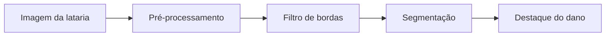
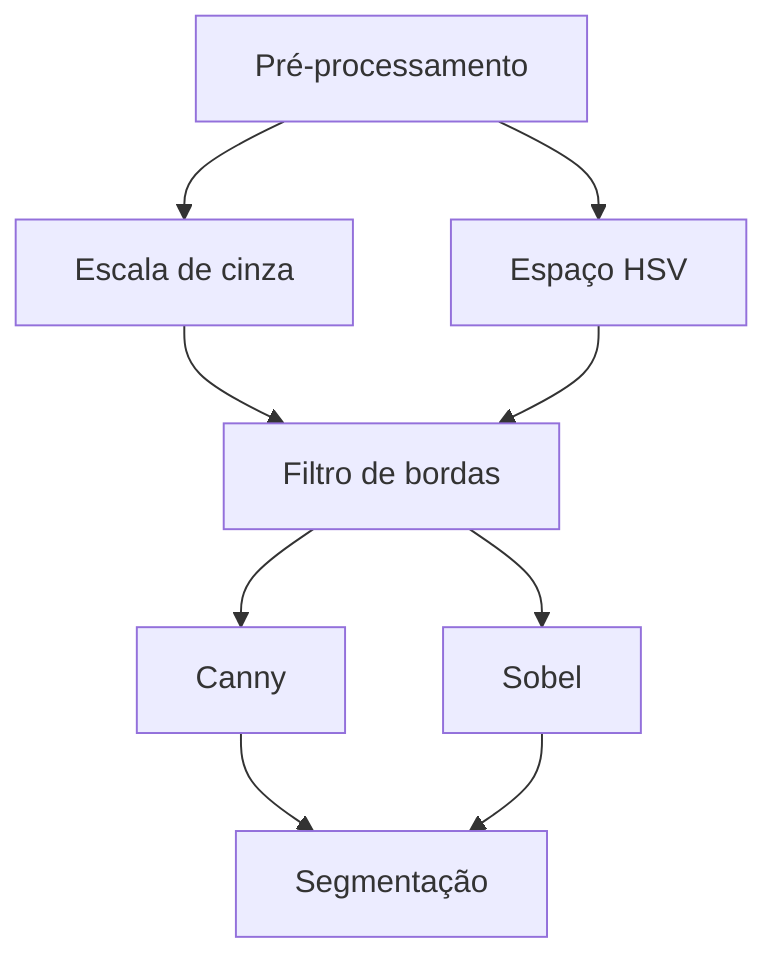

# Proposta Técnica — Vistoria Automática de Veículos (Detecção de Avarias na Lataria)

## 1. Problema

Locadoras de veículos precisam verificar, no momento da devolução do carro,
se ele retornou com alguma avaria (risco, amassado, trinca). Essa
verificação é feita hoje majoritariamente de forma manual: um funcionário
inspeciona visualmente a lataria do veículo.

A estratégia inicial cogitada para este projeto era comparar pixel a pixel
duas fotos do mesmo veículo (antes e depois), alinhando-as (ORB/SIFT) e
calculando a diferença estrutural entre elas. Essa abordagem se mostrou
frágil como ponto de partida: pequenas variações de ângulo, distância e
iluminação entre as duas capturas exigem um alinhamento muito preciso para
não gerar falsos positivos, o que é uma etapa complexa por si só.

A estratégia adotada a partir de agora foca no **reconhecimento e
segmentação direta de padrões de avaria na lataria do veículo**, a partir de
uma única fotografia tirada no momento da inspeção, sem depender de um
alinhamento fino entre duas capturas. Arranhões, amassados e trincas
produzem padrões visuais característicos (bordas finas e alongadas,
variações abruptas de brilho/sombra, descontinuidades de textura) que podem
ser detectados diretamente com técnicas clássicas de PDI (filtros de borda,
segmentação por cor/textura), sem exigir uma imagem de referência anterior.

Este problema envolve processamento e análise de imagens porque a decisão
depende de identificar, dentro de uma única imagem, regiões cujos padrões
de borda, textura e variação de brilho são compatíveis com avaria — uma
tarefa de detecção de bordas, segmentação de regiões e classificação
inicial do padrão encontrado.

Situação inicial: uma foto do veículo (ou de parte da lataria) tirada no
momento da inspeção de devolução.

Informação a ser produzida a partir da imagem: (a) localização das regiões
com padrão visual compatível com avaria (bounding box); (b) uma
classificação inicial heurística do padrão (ex.: "borda linear destacada =
possível arranhão"); (c) *(meta futura, M2/M3)* comparação opcional com uma
foto de referência da retirada do veículo, quando disponível, para reduzir
falsos positivos.

## 2. Contexto de aplicação

O sistema seria utilizado por locadoras de veículos no processo de
devolução, como apoio à vistoria feita pelo funcionário — não como
substituto do julgamento humano, mas como uma ferramenta que destaca
regiões suspeitas para revisão. O mesmo princípio se aplica a empresas de
gestão de frotas que fazem checagens periódicas dos veículos.

## 3. Objetivo

**Objetivo geral:** dada uma foto do veículo (ou de parte da lataria) no
momento da inspeção, produzir um mapa das regiões com padrão visual
compatível com avaria, indicando sua localização (bounding box) e uma
classificação inicial do padrão encontrado.

**Objetivos específicos:**
- Pré-processar a imagem (padronizar tamanho, converter para escala de
  cinza e para o espaço de cor HSV).
- Aplicar filtros de detecção de bordas (Canny/Sobel) para isolar padrões
  compatíveis com arranhões e trincas.
- Segmentar as regiões candidatas a partir das bordas e de variações de
  brilho/sombra típicas de amassados.
- Atribuir uma classificação inicial heurística ao padrão encontrado (ex.:
  borda linear e fina → possível arranhão; região de contraste de
  brilho/sombra → possível amassado).
- *(Meta para M2/M3)* Treinar um classificador supervisionado para os
  tipos de dano e, opcionalmente, comparar com foto de referência da
  retirada do veículo.

## 4. Entrada e saída esperadas

**Entrada:** foto do veículo (ou de parte da lataria) no momento da
inspeção.

**Saída:** a imagem processada apontando o local exato do dano (bounding
box) + uma classificação inicial (ex.: "borda linear destacada = possível
arranhão").

Pipeline conceitual:

Alternativas consideradas para pré-processamento e filtro de bordas:

Cada etapa, finalidade, técnica considerada, entrada/saída e dúvidas em
aberto:

| Etapa | Finalidade | Técnica considerada | Entrada | Saída | Dúvidas |
|---|---|---|---|---|---|
| Pré-processamento | Padronizar imagem e realçar informação relevante | Redimensionamento, conversão para escala de cinza e HSV | 1 imagem bruta | Imagem normalizada (cinza + HSV) | HSV isola bem sombra/brilho de amassado em fotos com iluminação variada? |
| Filtro de bordas | Isolar padrões lineares de arranhões/trincas | Canny, Sobel | Imagem normalizada | Mapa de bordas | Canny é suficiente ou Sobel captura melhor bordas sutis em lataria escura? |
| Segmentação | Isolar regiões candidatas a partir das bordas | Limiarização + morfologia (abertura/fechamento) | Mapa de bordas | Regiões segmentadas | Qual limiar generaliza entre diferentes cores de carro e condições de luz? |
| Destaque do dano | Localizar e classificar inicialmente o padrão | Bounding box + regras heurísticas (forma/orientação da região) | Regiões segmentadas | Imagem com bounding boxes + rótulo inicial | Que regras distinguem de forma confiável arranhão x amassado x sujeira/reflexo? |

## 5. Imagens e dados

- **Origem 1 — Conjunto inicial (M1):** 20 a 50 imagens de veículos com
  avarias (arranhões, amassados), coletadas manualmente via pesquisa no
  Google Imagens, para uso exclusivamente educacional neste projeto (sem
  fins comerciais e sem redistribuição fora deste contexto acadêmico) —
  adicionadas em `images/input/`.
- **Origem 2 — CarDD (Car Damage Detection Dataset):** dataset público mais
  amplo (4.000 imagens de alta resolução, mais de 9.000 instâncias anotadas
  de seis tipos de dano — risco, amassado, trinca, vidro quebrado, pneu
  furado, farol quebrado), candidato para ampliar o conjunto de dados em
  M2/M3. Disponível em https://cardd-ustc.github.io, mediante aceite dos
  termos de licença do Flickr/Shutterstock (as imagens não são
  redistribuídas diretamente neste repositório).

*(Quantidade exata, condições de aquisição e restrições de uso serão
detalhadas aqui conforme o levantamento avançar.)*

## 6. Arquitetura preliminar

Ver pipeline na seção 4. A organização do código seguirá:
- `src/`: módulos de pré-processamento, filtro de bordas, segmentação e
  destaque/classificação inicial do dano.
- `notebooks/`: experimentos exploratórios documentando decisões técnicas.
- `images/input/` e `images/results/`: dados de entrada e saídas geradas.

## 7. Estudo inicial de viabilidade

*(Em andamento — primeiro experimento: carregar imagens de latarias
danificadas, converter para escala de cinza e para o espaço HSV, aplicar
detecção de bordas (Canny/Sobel) para tentar isolar arranhões, e salvar os
resultados visuais em `images/results/`.)*

## 8. Referências

*(A completar com literatura técnica, documentação de bibliotecas e
trabalhos relacionados consultados.)*
